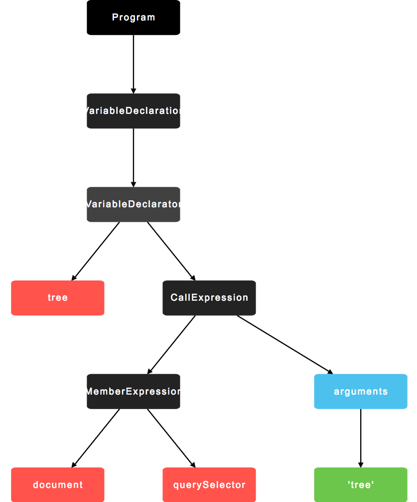

# 编写自定义 ESLint 规则

## 为什么使用 ESLint

ESLint 是最新的一个 JS 代码检查工具。优势在于灵活、可扩展性强，内置了大量实用的可配置规则，而且输出错误消息更加直接易读，便于 debug。

ESLint 的内在优势在于使用 JS Parser 把核心规则逻辑与规则定义很好的分离开来，ESLint 会使用 [espree](https://github.com/eslint/espree) 来生成 AST，然后将生成的 AST 传给指定的规则，规则可以检查传递过来的 AST 从而判断代码是否违反规则。

ESLint 的内置规则可以在其官方仓库里面找到 [eslint/lib/rules](https://github.com/eslint/eslint/tree/master/lib/rules)，每个规则都是一个独立的文件，这样维护与扩展起来也更加方便。

## 什么是 AST

AST 是 Abstract Syntax Tree 的缩写，代码的树形结构表达形式，AST 是一种数据结构，广泛应用于编译工具、代码审查和代码转换中。以常用的前端工具来说：

ESLint 使用 [espree] 生成 AST，Babel 使用 [babylon](https://github.com/babel/babel/tree/master/packages/babylon) 来生成 AST，UglifyJS2 使用 [acorn](https://github.com/ternjs/acorn) 来生成 AST。

以 `const tree = document.querySelector('tree')` 为例，其生成的 AST 结构为：



想要获得文本格式的 AST 可以访问 [astexplorer.net](https://astexplorer.net/#/gist/5bf235f04afd0147c87c1556b2fc2bde/278fd1d9b8a31e80b5ef173d3cc8e666d63a69e0) 来生成查阅。

## 编写自定义 ESLint 扩展

假设一个需求：编写一个规则来禁止使用 `getElementById`、`getElementsByTagName`、或者 `getElementsByClassName` 的使用。

为了方便以后扩展，我们新建一个目录，将自定义的规则统一存放在该目录下，以后可以将自定义规则发布至 npm。

```shell
// 目录名格式必须为 eslint-plugin-<plugin-name>
$ mkdir eslint-plugin-my-rules

$ cd eslint-plugin-my-rules

$ npm init -y

$ touch index.js

$ mkdir rules

$ cd rules

$ touch no-get-element-by.js
```

### 编写扩展

使用编辑器编辑新创建的 no-get-element-by.js：

```js
module.exports = (context) => {
    return {
        Identifier: function(node) {
            const blackList = [
                'getElementById',
                'getElementsByName',
                'getElementsByTagName',
                'getElementsByClassName',
            ];
            if (blackList.includes(node.name)) {
                context.report(node, `${node.name} is not allowed, please consider querySelector or querySelectorAll`);
            }
        }
    }
}
```
`Identifier` 表示规则作用于所有的 `type` 为 `Identifier` 的节点上，一旦发现 Identifier 节点的 `name` 属性为 `getElementsBy*` 就会报错。

调用更多内置的 API 方法可以查阅 [Working with Rules](https://eslint.org/docs/developer-guide/working-with-rules)。

使用编辑器编辑项目根目录的 index.js：

```js
module.exports = {
    rules: {
        'no-get-element-by': require('./rules/no-get-element-by'),
    },
}
```

### 调用扩展

要在项目中使用我们自定义的扩展首先需要先安装规则至工程项目：

```shell
$ npm install -S ~/Documents/eslint-plugin-my-rules
```

编辑项目中的 .eslintrc 配置文件，添加 `my-rules` 至 `plugin` 并开启 `my-rules/no-get-element-by`。

```
{
    "plugins": ["my-rules"],
    "rules": {
        "my-rules/no-get-element-by": 1
    }
}
```

为了测试，我们在项目中新建一个 test.js，内容如下：

```js
var user = document.getElementById('user');
```

现在执行项目的 npm script 调用 ESLint，检测到 `document.getElementBy*` 的调用应该会给出相应的提示：

```
 $ ./node_modules/.bin/eslint test.js

/home/tonni/Documents/eslint-test/test.js
  1:21  error  getElementById is not allowed, please consider querySelector or querySelectorAll  my-rules/no-get-element-by
```

如果自定义扩展针对全公司的项目所使用可以将我们之前创建的 ESLint 配置文件项目托管到 npm 上，这样更便于跨项目之间分享。

## 参考

1. https://eslint.org/docs/developer-guide/working-with-plugins
1. https://resources.jointjs.com/demos/javascript-ast
1. https://astexplorer.net/
