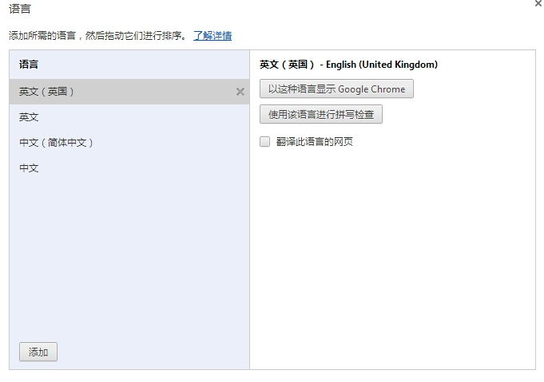

# 如何在 Mac 下更改特定应用语言首选项

这是之前遇到的一个问题，平时工作语言设置为了英文，Chrome 默认遵守系统语言设置，使用了英文即诶安，但是英文界面下的 Chrome 和中文界面下的 Chrome 在文本展现形式上有一个很大的不同，**中文界面下的 Chrome 展示中文时页面文字最小大小为 12px**，再小就不起效果了。而英文版的 Chrome 则没有这个问题。这个问题同样适用于日语、韩语和泰国语界面下的 Chrome，猜测是因为这些语言的字符密集度较高，太小的文字不容易识别。

为了在开发时更好的贴近终端用户所看到的效果决定将 Chrome 的语言更改为中文，但是 Mac 下面的 Chrome 不像 Windows 上的一样，不能直接在设置里面修改的。

Mac 版的 Chrome 下是没有”以这种语言显示 Google Chrome” 选项的。



经过一番搜索终于发现了解决办法， 其实很简单，只需要执行一个命令即可：

```
$ defaults write com.google.Chrome AppleLanguages '(zh-CN)'
```

中间的 `com.google.Chrome` 是应用的 bundle identifier，这个方法同样适用于其它的 mac 应用，如果想要更改其它应用的语言首选项只需通过下面的命令即可查询对应的 bundle identity：

```
/usr/libexec/PlistBuddy -c 'Print CFBundleIdentifier' /Applications/Google\ Chrome.app/Contents/Info.plist
```

将后面的 `/Applications/Google\ Chrome.app/Contents/Info.plist` 替换为目标应用的 Info.plist 路径即可。
