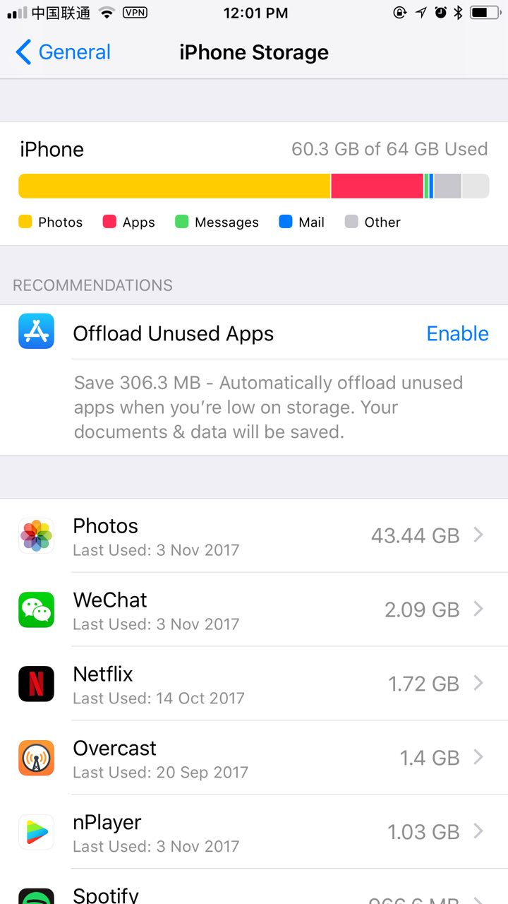
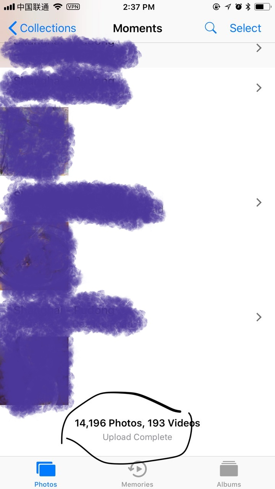
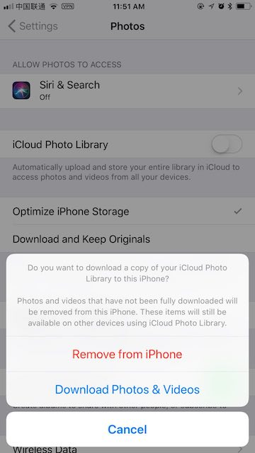
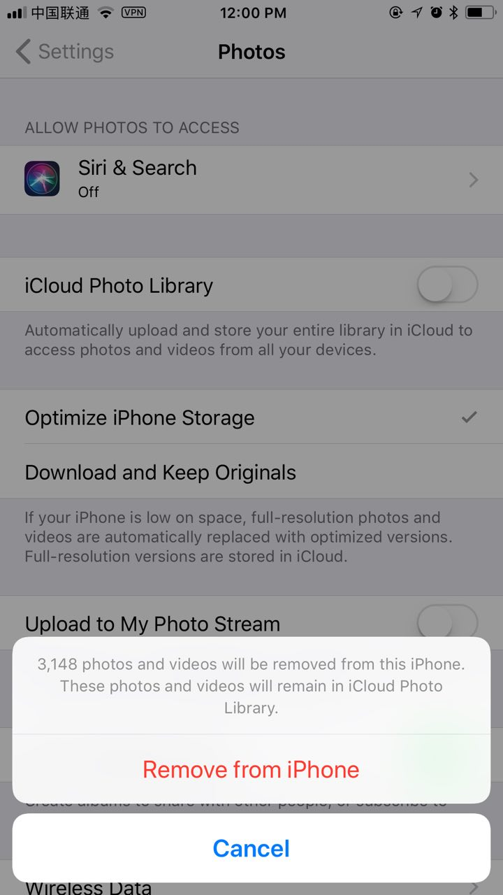
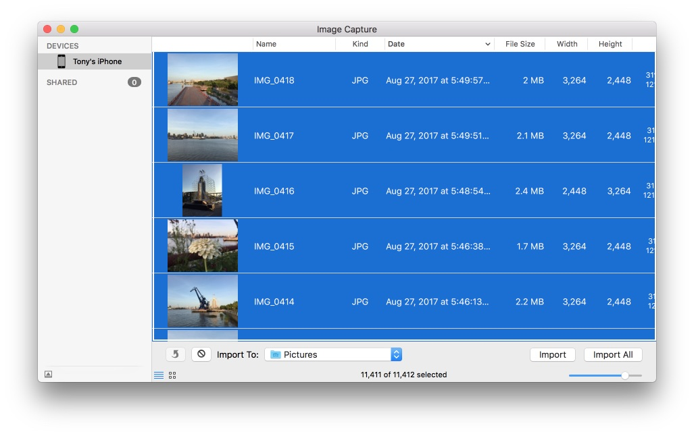
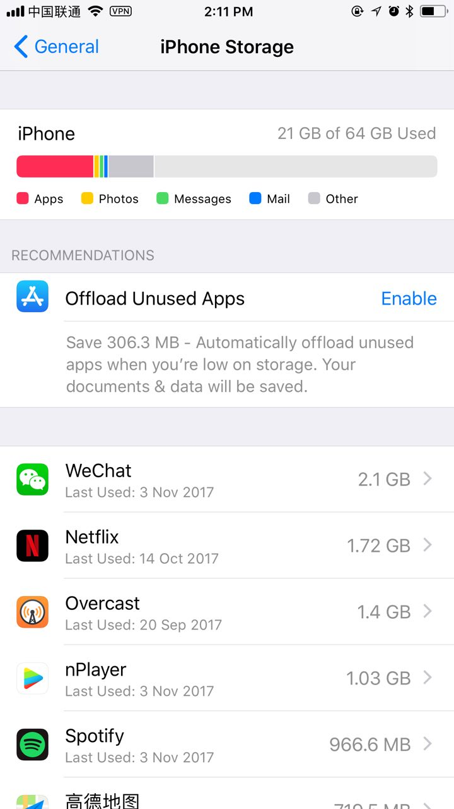

# Photos took too much space on your iPhone

**This solution requires a Mac 🖥️**

I’m using an iPhone 6 Plus with 64GB onboard storage, recently my phone ran out of storage, I have few apps, no movie, no music. After digging into the storage usage details, I realized the Photos app took about 43.44GB of storage! that’s insane, I subscribed the 50GB iCloud subscription and set `Optimize iPhone Storage` in Photos app, it should upload my photos to iCloud, delete the originals and just keep thumbnail photos, but apparently, it’s not working as Apple advertised.

I googled online and figured out how to free it up without wiping the phone, and here is how.

### 1. Make sure your photos on your phone are uploaded.

Open Photos app, scroll to the bottom, make sure all your photos are complete uploaded to iCloud.

### 2. Disable iCloud Photo Library

Goto Settings -> Photos, disable iCloud Photo Library, you will be asked

> Do you want to download a copy of your iCloud Photo Library to this iPhone?

select `Remove from iPhone` and confirm.

### 3. Completely remove photos on your phone.

1. Connect your phone to Mac, open Image Capture app.

1. Chose your phone on devices list.

1. Press <kbd>⌘</kbd> + <kbd>a</kbd> to select all photos on your phone.

1. Right-click on selected photos and delete(this may take a few minutes, be patient).

### 4. Re-enable iCloud Photo Library

Goto Photos setting again, re-enable the iCloud Photo Library, make sure `Optimize iPhone Storage` is chosen. Now once the phone is connected to a power source, Photos will download thumbnails from your iCloud. Now I’m able to shrink the Photos space down to literally nothing!

