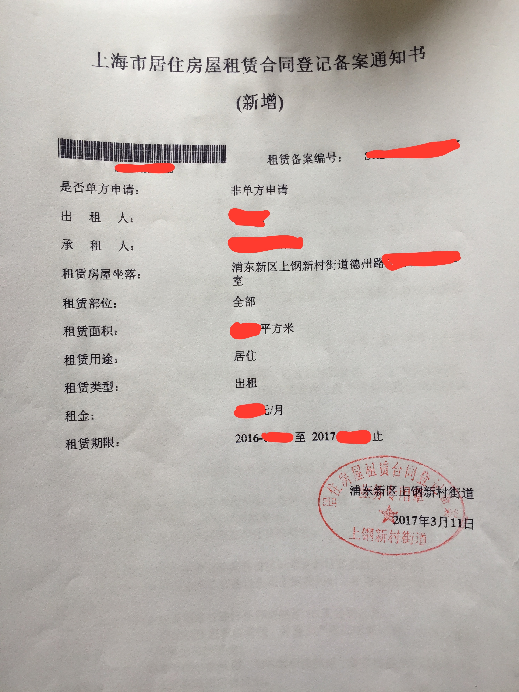
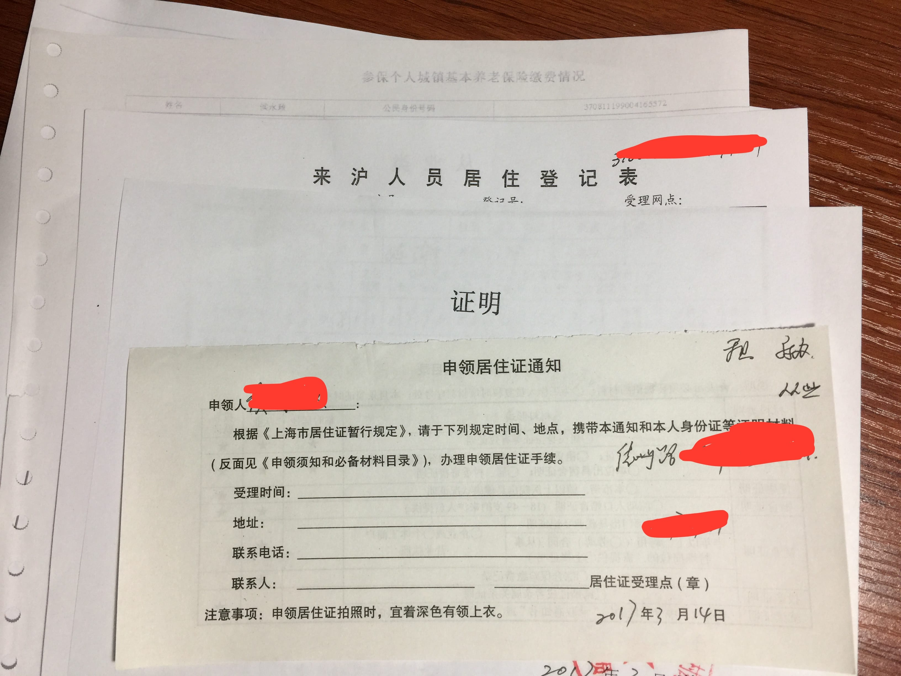

# 上海市居住证办理指南

更多讨论请前往：https://www.v2ex.com/t/348036。

===

刚办完居住证，办理前查了不少资料，本以为很麻烦而且收费，办完后发现其实很简单，除了复印资料花的十几块钱其它也没有花任何手续费，在办理的过程中把每一步记录了下来，现在办理完了整理好分享出来，希望对大家有所帮助。

这些都是我的个人经历，办理时间为 2017 年 3 月，区域为浦东新区，每个区的居住证政策不同，这份经历仅供参考，建议去居委会与街道事务受理中心去咨询具体办理事项，只要房东愿意帮忙居住证很好办理的。

## 第一步：去街道事务受理中心办理租赁备案

准备资料：

- 租房合同，建议多写一份租房合同，因为办理的时候街道事务受理中心会保留一份合同原件，合同必须是标准的《上海市房屋租赁合同》，可以在这里下载到：http://www.shjjw.gov.cn/gb/node2/n11/n776/315222.html。
- 房产证。
- 房东身份证、租客身份证，街道事务受理中心可以免费复印复印件。

办理过程很简单，而且是免费的，没有网上说的要缴纳年租金的 5% 税费。到了柜台检查证件、租客与房东填写一份《租赁备案申请书》，示范样本如下：

填写完成后会发放一份《房屋租赁合同登记备案通知书》，如下：

临走之前记得在街道事务受理中心打印一份养老保险缴纳记录单，有自动查询机器，刷身份证就能自动打印，后面居委会那一步会用到。

## 第二步：去居委会核实居住信息

准备资料：

- 养老保险缴费记录单。
- 劳动合同复印件。
- 房屋租赁合同登记备案通知书原件加一份复印件。
- 身份证正反面复印件。

居委会核实居住信息后登记到系统中并给你如下资料：

- 签发居住证明。
- 申领居住证通知单。
- 来沪人员居住登记表（如果你没有的话居委会会就地给你登记，无需东奔西跑）。
- 劳动合同复印件。
- 社保记录单

### 第三步：去街道事务受理中心提交资料

准备资料：

- 身份证。
- 从居委会拿到的证件。

把证件提交到街道事务受理中心后填写《上海市居住证申请表》，拍照，工作人员要求出示身份证核实信息，然后给你一张《上海市居住证受理回执》并让你关注微信查询审核进度，一旦审核通过再过大约一个月即可到街道事务受理中心领取，制证进度可以在[上海市民信息服务网](http://www.962222.net)查询，一旦“网点领证状态”为“可领取“即可前往街道事务受理中心领取。

### 第四步：领取居住证

准备资料：

- 身份证。
- 上海市居住证受理回执。

到了街道事务受理中心签名确认后即可领取。

祝你好运！
